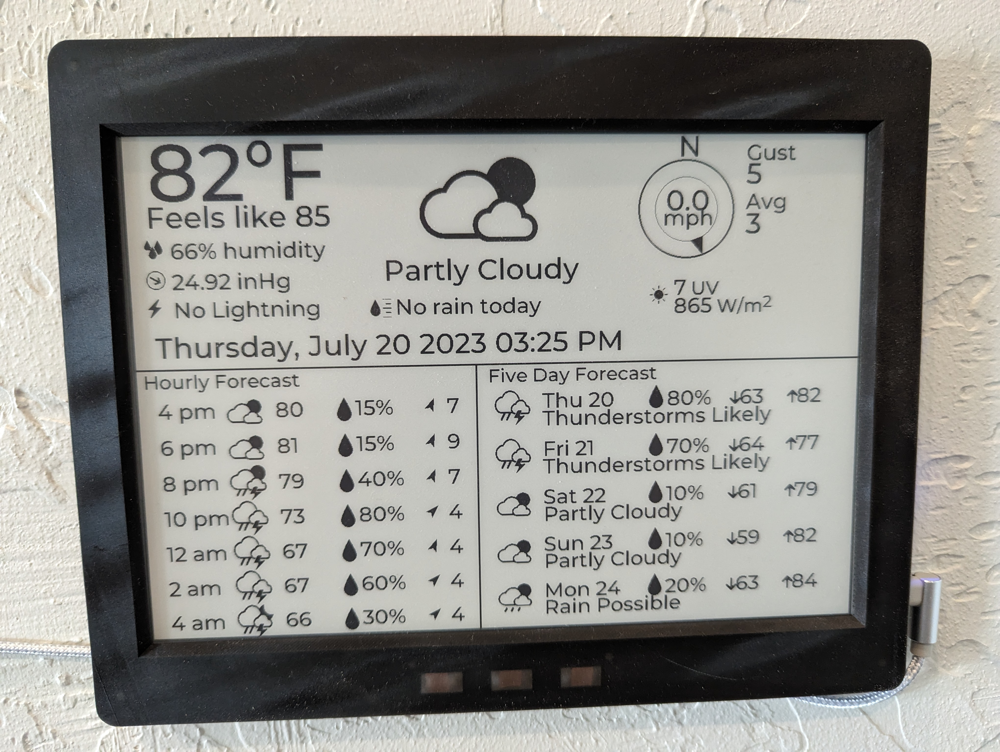

# Tempest_Inkscape10_Display
WeatherFlow Tempest display for Inkscape 10.

Edit the code to add your wifi SSID and password (lines 13-14) and your stationID/API key (line 70).  The code for the display is a giant mess because I started with the inkplate display builder and added a lot of custom code and started the process of renaming everything to something more sensical than text67.

The code listens for the UDP broadcast but gets most of it's info from the API.

